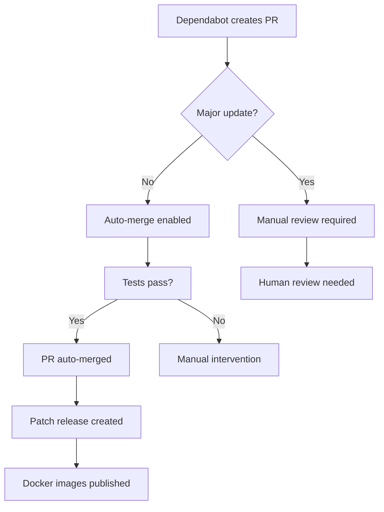

# Dependabot Automation System

## Overview

The validate-coverage action now has full automated dependency management with intelligent patch release creation. This system maintains manual control for major changes while automating routine updates.

## 🤖 Automated Workflow

### Dependabot PRs → Auto-merge → Patch Release



## 📋 Automation Rules

### ✅ Auto-merged (with patch release)
- **Patch updates**: `1.0.1` → `1.0.2`
- **Minor updates**: `1.0.0` → `1.1.0`
- **Security updates**: Any non-major security fixes
- **GitHub Actions**: Minor/patch workflow updates
- **Docker dependencies**: Base image updates

### 🚫 Manual review required
- **Major updates**: `1.x.x` → `2.0.0`
- **Breaking changes**: API changes, deprecations
- **Complex updates**: Multi-dependency changes

## 🔧 Workflow Components

### 1. `enable-auto-merge.yml`
**Triggers**: Dependabot PR opened/updated
**Functions**:
- Analyzes PR title for update type
- Auto-enables merge for non-major updates
- Blocks major updates with manual review labels
- Comments on PRs with status and next steps

### 2. `dependabot-auto-release.yml`
**Triggers**: Push to main with dependency commits
**Functions**:
- Detects merged dependabot updates
- Calculates next patch version automatically
- Creates release branch with version pinning
- Tags and publishes new patch release

### 3. `dependabot-security.yml`
**Triggers**: Security-related PRs
**Functions**:
- Adds priority labels to security updates
- Fast-tracks security fixes
- Provides clear communication about security timeline

### 4. `dependabot.yml`
**Configuration**:
- Targets only `main` branch (simplified)
- Weekly schedule for routine updates
- Ignores major version updates
- GitHub Actions and Docker ecosystems

## 📦 Release Process

### Automatic Patch Releases
When dependabot updates are merged:

1. **Detection**: System detects dependency commits on main
2. **Version Calculation**: Next patch version determined automatically
3. **Release Branch**: `release/v1` updated with new version
4. **Action Pinning**: `action.yml` updated to reference specific version
5. **Tagging**: Creates `v1.2.3`, `v1.2`, `v1` tags
6. **Publishing**: GitHub Actions builds and publishes Docker images
7. **Main Reset**: `action.yml` on main reset to use `latest`

### Version Examples
```
Current: v1.0.16
Dependabot merge → Auto-release: v1.0.17
Dependabot merge → Auto-release: v1.0.18
Manual release → v1.1.0 or v2.0.0
```

## 🏷️ PR Labels

The system automatically applies labels:

- `dependencies` - All dependency updates
- `auto-merge` - Non-major updates that will auto-merge
- `major-update` - Major version changes requiring review
- `manual-review-required` - Blocks auto-merge
- `security` - Security-related updates
- `priority-critical` - Critical security fixes

## 📝 PR Comments

### Auto-merge PRs
```
🤖 Auto-merge Enabled

This dependency update will be automatically merged once all checks pass.

What happens next:
1. ✅ All tests and validations must pass
2. 🔄 PR will be auto-merged (squash merge)
3. 🚀 A new patch release will be automatically created
4. 📦 Docker images will be built and published
```

### Major update PRs
```
🚨 Major Update Detected

This PR contains a major version update that requires manual review.

Manual steps required:
1. 👀 Review the CHANGELOG for breaking changes
2. 🧪 Test the changes locally if needed
3. ✅ Manually merge when ready
4. 🚀 Create a release manually using `./scripts/create-release.sh`
```

### Security PRs
```
🚨 CRITICAL SECURITY UPDATE 🚨

This PR addresses a security vulnerability and has been marked as critical priority.

Automatic handling:
- ⚡ Will be auto-merged once all checks pass
- 🚀 Patch release will be created immediately after merge
- 📦 New Docker images will be published with the security fix
```

## 🔍 Monitoring

### What to Monitor
- **GitHub Actions**: Dependabot workflow success/failure
- **Release Timeline**: Patch releases created within hours of merges
- **Docker Images**: New images published to GHCR
- **Security Updates**: Critical fixes processed quickly

### Manual Intervention Needed
- Major update PRs require manual merge decision
- Failed auto-releases need investigation
- Complex dependency conflicts
- Test failures in dependabot PRs

## 🎛️ Manual Override

### Force Manual Release
Even with automation, you can still create manual releases:
```bash
./scripts/create-release.sh 1.2.3
```

### Disable Auto-merge
Remove the `auto-merge` label from a PR to prevent automatic merging.

### Emergency Releases
Security or critical fixes can be fast-tracked using the manual release script.

## ✅ Benefits

- **🚀 Faster Security Fixes**: Automated security update processing
- **📅 Consistent Releases**: Regular patch releases for dependency updates  
- **🛡️ Safe Major Updates**: Manual review prevents breaking changes
- **⚡ Reduced Maintenance**: Less manual dependency management
- **📋 Clear Communication**: Automated PR comments explain process
- **🔄 Reliable Process**: Tests must pass before any auto-merge

## 🔮 Future Enhancements

- **Changelog Generation**: Automatic release notes for dependency updates
- **Rollback Capability**: Quick revert for problematic releases
- **Metrics Dashboard**: Track automation success rates
- **Custom Schedules**: Different timing for different dependency types

The system now provides the best of both worlds: automated routine maintenance with human oversight for important changes! 🎉