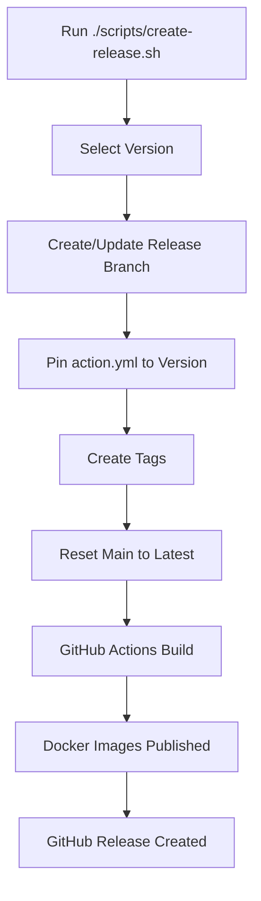

# Release Process

This document describes the simplified manual release process for validate-coverage.

## Quick Start

To create a new release:

```bash
# Interactive mode (recommended)
./scripts/create-release.sh

# Direct version specification
./scripts/create-release.sh 1.2.3
```

## Release Architecture

### Manual-Only Releases
- All releases are created manually using `scripts/create-release.sh`
- No automated releases or version bumping
- Full control over when and what gets released

### Intelligent Version Suggestions
The script automatically suggests next versions based on semantic versioning:
- **Patch**: `1.0.16` → `1.0.17` (bug fixes)
- **Minor**: `1.0.16` → `1.1.0` (new features)
- **Major**: `1.0.16` → `2.0.0` (breaking changes)

### Branch Strategy
- **Main branch**: Always uses `latest` Docker image in `action.yml`
- **Release branches**: Pin to specific versions (e.g., `1.2.3`)
- Release branches automatically track main content

## Requirements

Before running the release script:
1. Must be on `main` branch
2. Working directory must be clean (no uncommitted changes)
3. Main branch must be up to date with origin

## What the Script Does

1. **Validation**: Checks branch, working directory, and upstream sync
2. **Version Selection**: Interactive menu or direct version input
3. **Branch Management**: Creates/updates `release/vX` branch from main
4. **Version Pinning**: Updates `action.yml` to reference specific version
5. **Tag Creation**: Creates `vX.Y.Z`, `vX.Y`, and `vX` tags
6. **Main Reset**: Ensures `action.yml` on main uses `latest`
7. **Publishing**: GitHub Actions builds and publishes Docker images

## Release Workflow



## GitHub Actions

The following workflows support releases:

- **`release-tags.yml`**: Builds Docker images when tags are pushed
- **`main-push.yml`**: Builds development images on main
- **`validate-action.yml`**: Validates action.yml configuration
- **`test.yml`**: Runs tests (reusable workflow)

## Usage Examples

### Interactive Release
```bash
$ ./scripts/create-release.sh

🚀 Validate Coverage Release Script

Current version: v1.0.16

Select next version:

1) (patch)  1.0.17
2) (minor)  1.1.0  
3) (major)  2.0.0

4) (custom) Enter custom version

Choose option (1-4): 1

Selected patch version: 1.0.17
Proceed with release v1.0.17? (y/N): y
```

### Direct Release
```bash
$ ./scripts/create-release.sh 1.2.3

🚀 Validate Coverage Release Script

Using provided version: 1.2.3
Proceed with release v1.2.3? (y/N): y
```

## Validation

After each release:
1. Monitor GitHub Actions: https://github.com/VlinderSoftware/validate-coverage/actions
2. Verify Docker images: https://github.com/VlinderSoftware/validate-coverage/pkgs/container/validate-coverage
3. Test the action: `docker pull ghcr.io/vlindersoftware/validate-coverage:1.2.3`

## Future Automation

Later, dependabot updates can be configured to automatically create patch releases,
but the foundation is now solid for manual control when needed.
